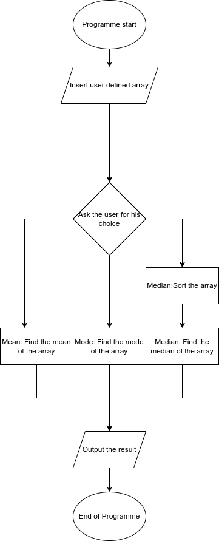

# Lab 3
#### Description

Create a java program that performs the following operation:

-   The program should collect an integer array from the user
-   After the array is entered, you need to create a menu of items

1.  Find the Mean Value
2.  Find the Median Value
3.  Find the Mode Value  
    

From the user-given array.

#### working

#### output
Enter the number of elements of the array
5
1
1
6
6
1
Enter the function that you want to preform 
1. MEAN
2. MODE
3. MEDIAN
2
1

Enter the number of elements of the array
5
1
1
6
6
1
Enter the function that you want to preform 
1. MEAN
2. MODE
3. MEDIAN
2
1

Enter the number of elements of the array
8
1
2
3
4
5
6
7
8
Enter the function that you want to preform 
1. MEAN
2. MODE
2. MEDIAN
1
4.5

.

#### contraints
The program should have a minimum of 3 functions apart from the main function; each of the functions implements the Mean, Median, and Mode computation by accepting the array user has entered as a parameter and returning the value as a result. From the main method, you will display the result

