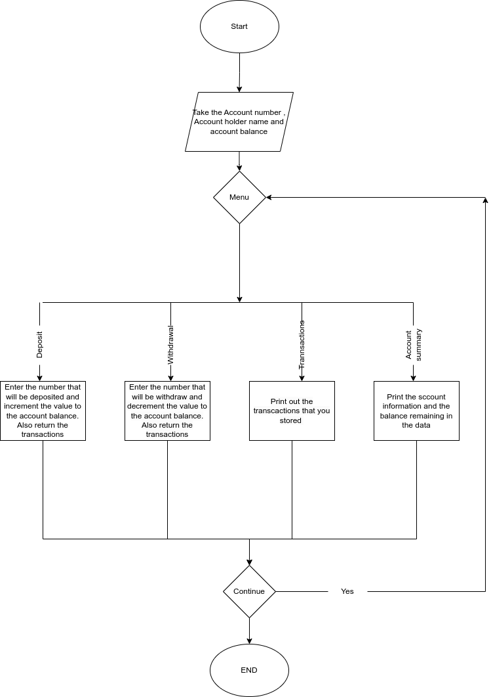

# Lab 4
#### Description

Write a JAVA Menu driven program that does the following:
-   You  **MUST** have the below as functions

-   To initialize the customer  
    
-   To deposit money
-   To withdraw money
-   To print the transactions
-   To print account summary

-   Your  **_menu_** will have the following operations once the customer is created  
    

-   To deposit money
-   To withdraw money
-   To print the transactions
-   To print account summary

#### working

#### output
Enter your Name
Keegan
Enter your account number
22122124
Enter your account balance
200
1.Deposit 
2.Withdraw 
3.Trancaction output 
4.Account Summary
1
Enter the amount to be deposited
300
Do you want to continue (1/0)
1
1.Deposit 
2.Withdraw 
3.Trancaction output 
4.Account Summary
2
Enter the amount to be Withdrawn
600
Not Enough Cash
Do you want to continue (1/0)
1
1.Deposit 
2.Withdraw 
3.Trancaction output 
4.Account Summary
2
Enter the amount to be Withdrawn
250
Do you want to continue (1/0)
1
1.Deposit 
2.Withdraw 
3.Trancaction output 
4.Account Summary
3
The following transactions were made in the account:

300.0 has been deposited current balance is 500.0 Time 2023-02-22 17:04:21.222
2023-02-22 17:04:21.222
250.0 has been withdrawn current balance is 250.0 Time 2023-02-22 17:04:21.222

Do you want to continue (1/0)
1
1.Deposit 
2.Withdraw 
3.Trancaction output 
4.Account Summary
4
Account NO.:- 22122124 
Account Name:- Keegan 
Balance:- 250.000000
Do you want to continue (1/0)
0
#### contraints
-   You can  **ONLY** have the below variables as global variables

-   Account Number
-   Account Holder Name
-   Account Balance

