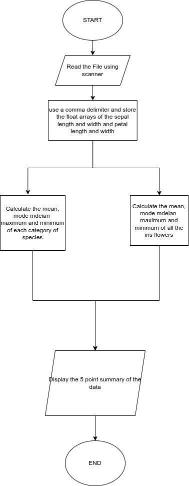

# Lab 7

#### Description

Create a new folder in git named 'Lab 7' for the following question and solve the following: create a flowchart and document the results, constraints, etc., in the README file for the lab.

Given the famous iris dataset, find the 5-point summary [Mean, Median, Mode, Min, Max] for the attributes: SepalLengthCm, SepalWidthCm, PetalLengthCm, PetalWidthCm.

Once the overall summary statistics have been calculated, identify the summary statistics for each Species of iris flower [Iris-setosa, Iris-versicolor, Iris-virginica].

You have been given an HTML file; from the HTML File, identify the Top categories, display it to the user, and write the content to the file.
#### Flowchart

#### Output
[Output File](./iris.txt)
#### Contraints

- Present your results in the appropriate format and write the results in a file.

